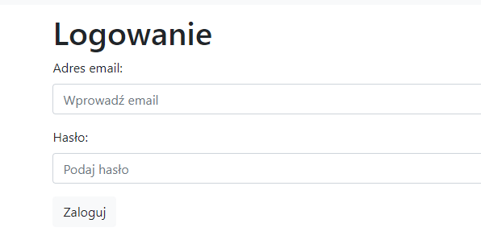
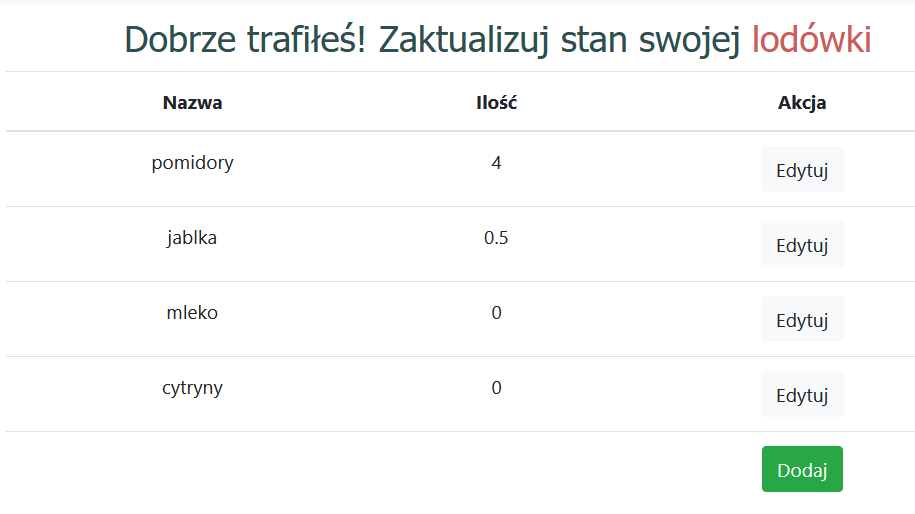
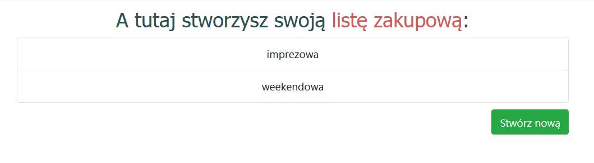
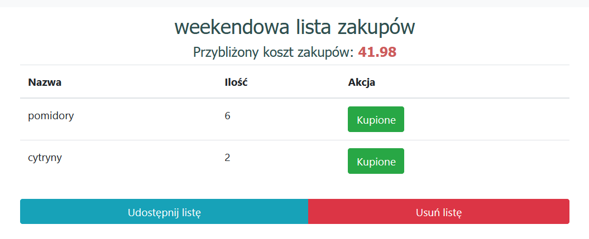
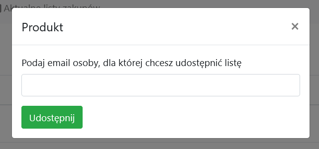

# Wstęp

Aplikacja MyShopper to pomoc przy codziennych zakupach. Po wprowadzeniu aktualnego stanu lodówki, aplikacja daje zarejestrowanemu użytkownikowi możliwość tworzenia wielu list zakupowych i modyfikacji już istniejących w zależności od potrzeb. Łatwy dostęp do stanu lodówki to dla użytkownika możliwość rejestrowania na bieżąco listy produktów, w które należy się zaopatrzyć przy następnej wizycie w sklepie.

Aplikacja umożliwia również generowanie listy zakupów w formie pliku, którym następnie można podzielić się z bliską osobą.

## Funkcjonalności
### Logowanie

Aplikacja działa w sposób spersonalizowany, a co za tym idzie wymaga uprzedniej rejestracji. Zarejestrowany i zalogowany użytkownik ma możliwość tworzenia spersonalizowanych list zakupów i uzupełnianie listy produktów, jakie posiada.

### Aktualizacja stanu lodówki

Za pomocą przycisku dodaj użytkownik może w prosty sposób dodawać kolejne produty, które znajdą się w jego lodówce. Oprócz nazwy produktu i ilości, można również podać szacowaną cenę. Dzięki temu aplikacja podaje przybliżony koszt całych zakupów w sklepie, a co za tgym idzie lepszą kontrolę wydatków.

### Tworzenie listy zakupowej

Aplikacja umożliwia tworzenie wielu list zakupowych, (np. imprezowa, codzienna) i ich modyfikację w zależności od potrzeb, dzięki czemu zapisana lista może być ponownie wykorzysta w przyszłości.

### Aktualne listy zakupów

To podgląd na aktualne, niezrealizowane jeszcze listy zakupów.

### Eksportowanie listy zakupów do pliku

Aplikacja umożliwia eksport utworzonej listy zakupów do pliku, dzięki czemu listę można wydrukować lub podzielić się nią nawet z osobą niezarejestrowaną.

## Wykorzystane technologie

### Vue.js

Środowisko do tworzenia jednostronnicowego interfejsu użytkownika oparta na języku JavaScript.

### Bootstrap/Bootstrap-vue

Biblioteki CSS zawierające zbiór podstawowych komponentów html.

### Spring Boot

Narzędzie bazujące na Spring'u, pozwalające na utworzenie własnego API. Wykorzystany został do stworzenia aplikacji backendowej obsługującej kontrolery, serwisy oraz połączenie z bazą danych, w której przechowywane są niezbędne dane użytkowników.

### myBatis

Framework służący do stworzenia połączenia z bazą danych, pozwalający na wygodne i czytelne mapowanie obiektów bazodanowych na obiekty wykorzystywane w aplikacji.

### mySQL

Relacyjna baza danych, której architektura została stworzona na potrzeby projektu.

### Lombok

Framework ułatwiający definiowanie klas w języku Java. Kod powstały dzięki jego użyciu jest czytelniejszy oraz bardziej skompresowany.

## Autorzy

Izabela Stań

Mateusz Ślusarczyk

Eryk Tomaszewski